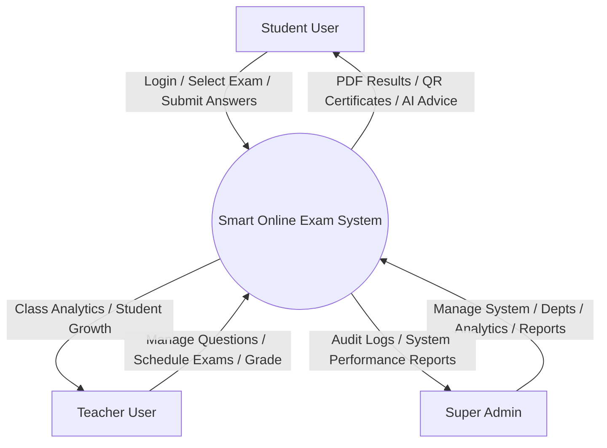
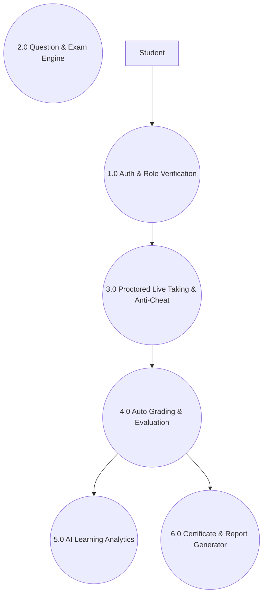

# Data Flow Diagrams (DFD)
## Smart Online Examination & Learning Analytics System

### DFD Level 0 (Context Diagram)

```mermaid
graph TD
    Student[Student User] -->|Login / Select Exam / Submit Answers| System((Smart Online Exam System))
    Teacher[Teacher User] -->|Manage Questions / Schedule Exams / Grade| System
    Admin[Super Admin] -->|Manage System / Depts / Analytics / Reports| System
    System -->|PDF Results / QR Certificates / AI Advice| Student
    System -->|Class Analytics / Student Growth| Teacher
    System -->|Audit Logs / System Performance Reports| Admin
```

### DFD Level 1 (Process Breakdown)

```mermaid
graph TD
    Process1((1.0 Auth & Role Verification))
    Process2((2.0 Question & Exam Engine))
    Process3((3.0 Proctored Live Taking & Anti-Cheat))
    Process4((4.0 Auto Grading & Evaluation))
    Process5((5.0 AI Learning Analytics))
    Process6((6.0 Certificate & Report Generator))

    Student --> Process1
    Process1 --> Process3
    Process3 --> Process4
    Process4 --> Process5
    Process4 --> Process6
```
