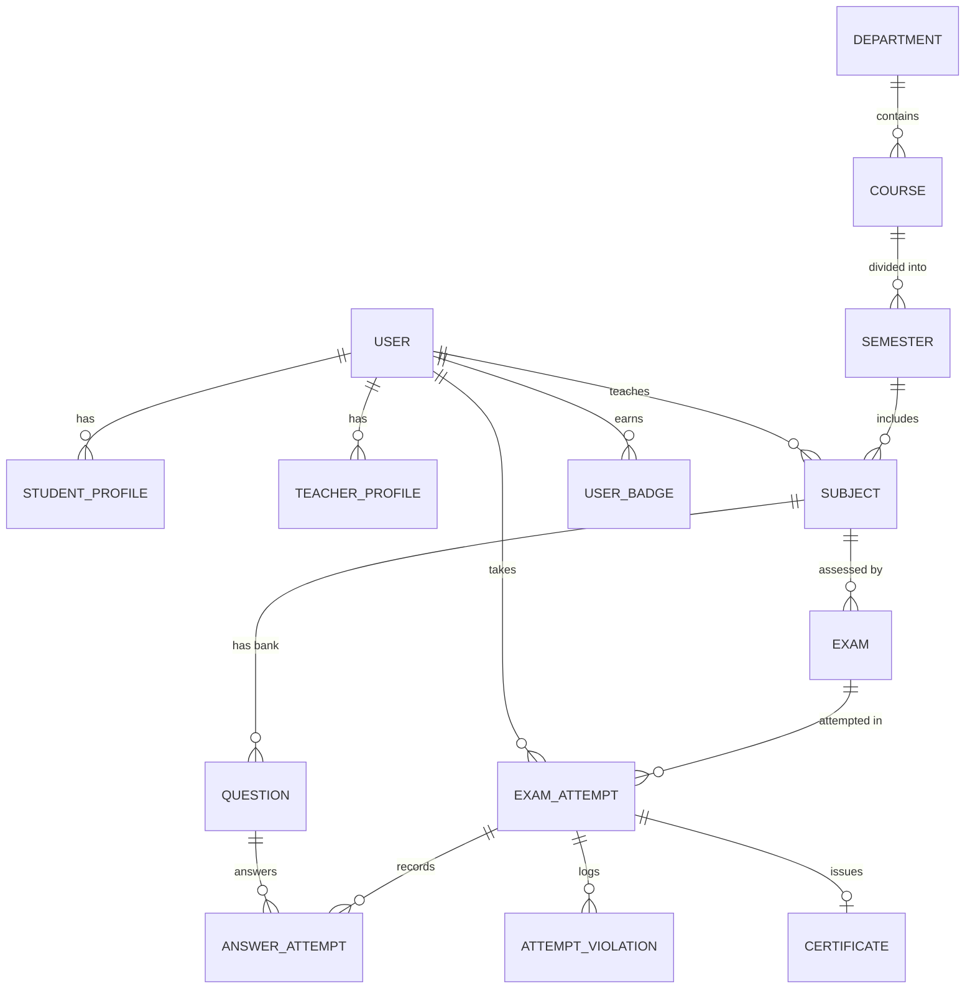

# Entity-Relationship (ER) Diagram
## Smart Online Examination & Learning Analytics System

```mermaid
erDiagram
    USER ||--o{ STUDENT_PROFILE : "has"
    USER ||--o{ TEACHER_PROFILE : "has"
    DEPARTMENT ||--o{ COURSE : "contains"
    COURSE ||--o{ SEMESTER : "divided into"
    SEMESTER ||--o{ SUBJECT : "includes"
    USER ||--o{ SUBJECT : "teaches"
    SUBJECT ||--o{ QUESTION : "has bank"
    SUBJECT ||--o{ EXAM : "assessed by"
    EXAM ||--o{ EXAM_ATTEMPT : "attempted in"
    USER ||--o{ EXAM_ATTEMPT : "takes"
    EXAM_ATTEMPT ||--o{ ANSWER_ATTEMPT : "records"
    QUESTION ||--o{ ANSWER_ATTEMPT : "answers"
    EXAM_ATTEMPT ||--o{ ATTEMPT_VIOLATION : "logs"
    EXAM_ATTEMPT ||--o| CERTIFICATE : "issues"
    USER ||--o{ USER_BADGE : "earns"
```
