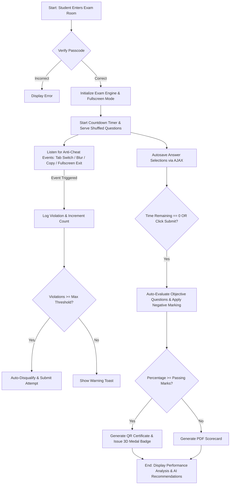

# System Flowcharts

## 1. Student Exam-Taking & Anti-Cheating Execution Flowchart

```mermaid
flowchart TD
    A[Start: Student Enters Exam Room] --> B{Verify Passcode}
    B -- Incorrect --> C[Display Error]
    B -- Correct --> D[Initialize Exam Engine & Fullscreen Mode]
    D --> E[Start Countdown Timer & Serve Shuffled Questions]
    E --> F[Listen for Anti-Cheat Events: Tab Switch / Blur / Copy / Fullscreen Exit]
    F -- Event Triggered --> G[Log Violation & Increment Count]
    G --> H{Violations >= Max Threshold?}
    H -- Yes --> I[Auto-Disqualify & Submit Attempt]
    H -- No --> J[Show Warning Toast]
    E --> K[Autosave Answer Selections via AJAX]
    K --> L{Time Remaining == 0 OR Click Submit?}
    L -- Yes --> M[Auto-Evaluate Objective Questions & Apply Negative Marking]
    M --> N{Percentage >= Passing Marks?}
    N -- Yes --> O[Generate QR Certificate & Issue 3D Medal Badge]
    N -- No --> P[Generate PDF Scorecard]
    O --> Q[End: Display Performance Analysis & AI Recommendations]
    P --> Q
```
